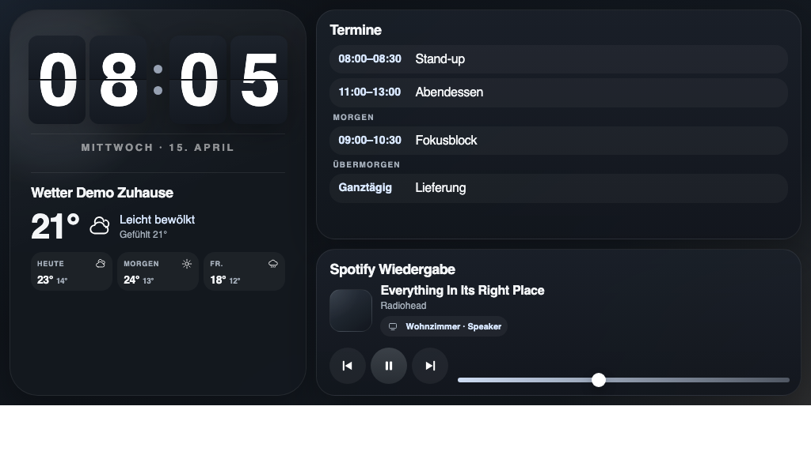
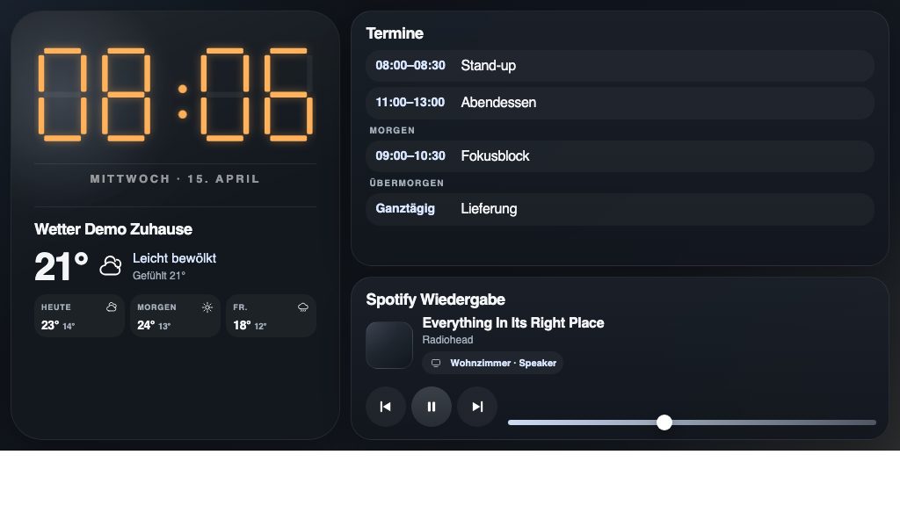
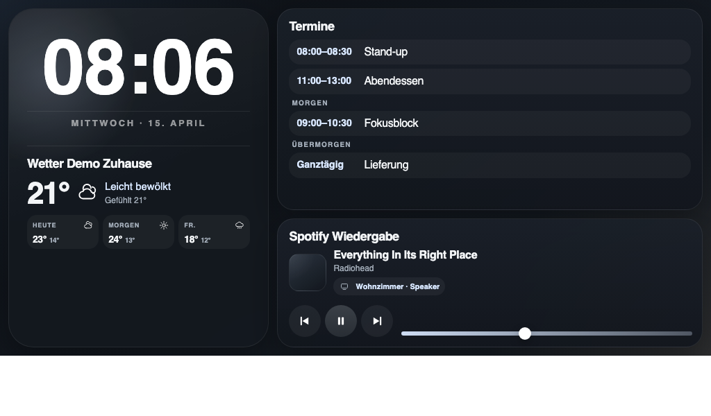
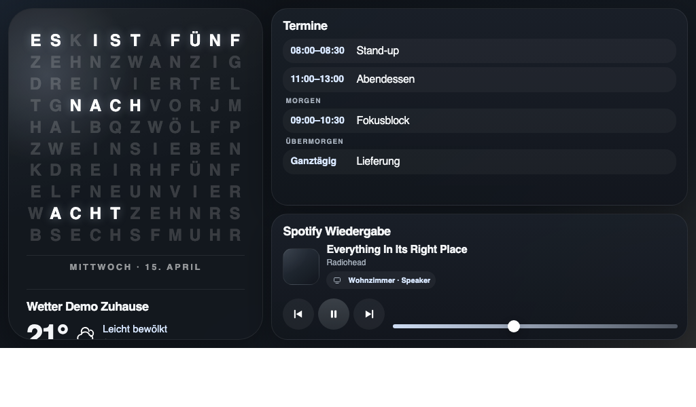
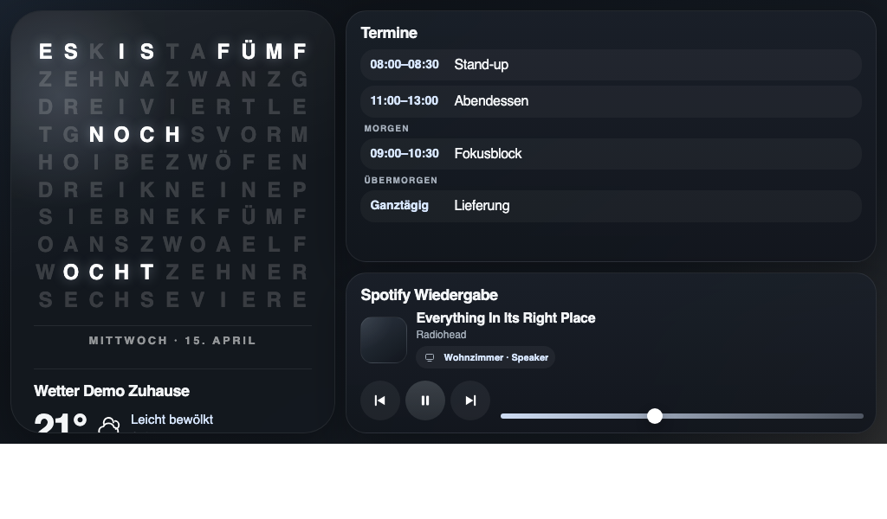
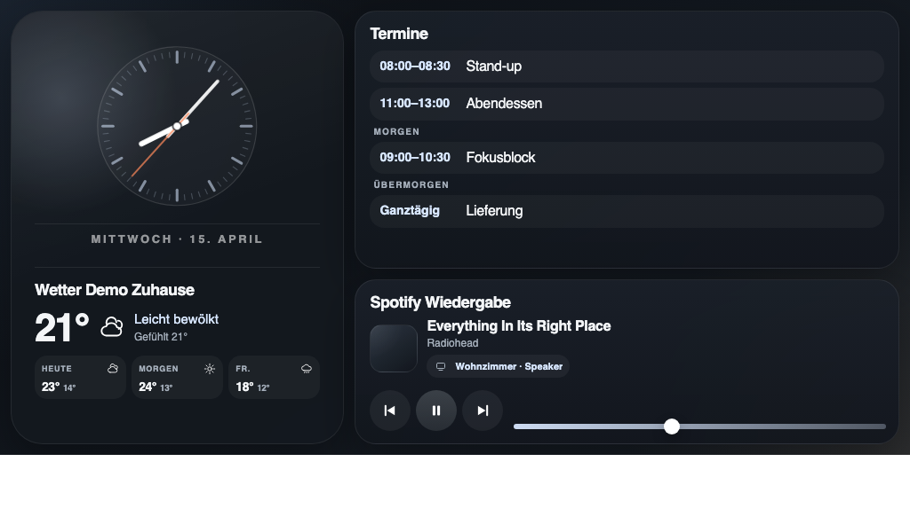

# Smart Display for Raspberry Pi Zero 2 W

Lightweight smart-display app for a `1024x600` touch panel in kiosk mode. The stack is deliberately minimal: a single Python process aggregates data, caches image sources, and serves a small server-rendered web UI. The browser on the Pi only renders local HTML, CSS, and JavaScript — no build step on the device.

## Watch Faces

Six swappable hero clocks. Tap the hero clock to cycle through them; the choice persists in the browser (`localStorage`).

| | | |
|---|---|---|
|  **Flip** (default) |  **LCD** |  **Pulse** |
|  **QLOCKTWO** |  **QLOCKTWO OÖ** |  **Analog** |

Regenerate the screenshots with `bash scripts/take-screenshots.sh` (headless Chrome against the local demo server, 1024×600).

> The UI ships in German — this is a personal device. For reference: `Termine` = Calendar, `Wetter Zuhause` = Home Weather, `Spotify Wiedergabe` = Spotify Playback, `Berühren zum Aufwecken` = Touch to wake. The QLOCKTWO OÖ face is the Upper Austrian dialect variant of the classic word clock.

## Architecture

- Backend: `Python 3.11`, `Flask`, `Waitress`
- UI: server-rendered shell with `HTML`, `CSS`, vanilla `JS`
- Data flow: background jobs periodically fetch weather, CalDAV, Spotify, and Lightroom; the UI only polls `GET /api/state`
- Persistence: `data/last_good.json` holds the last valid dashboard state; `data/screensaver/manifest.json` plus pre-converted images back the screensaver
- Runtime model: `smart-display.service` runs the backend, `smart-display-kiosk.service` runs Chromium in fullscreen

## Why this stack

- No heavy SPA framework: less RAM, fewer re-renders, no JS build on the Pi
- Python fits CalDAV, image processing, and pragmatic HTML scraping for Lightroom well
- A local web UI stays easy to deploy and cleanly separates data fetching from rendering
- `last known good` plus the local image cache keep the surface stable when individual services fail

## Project structure

```text
config/                  JSON-compatible YAML defaults
deploy/systemd/          systemd units for backend and kiosk
deploy/x11/              kiosk startup script for Chromium
smart_display/           app, providers, cache, scheduler, web UI
tests/                   small unit tests for core logic
data/                    runtime data and local screensaver cache
```

## Running locally

```bash
python3 -m venv .venv
. .venv/bin/activate
pip install -e .
cp .env.example .env
python -m smart_display.app
```

Optional: local demo mode without real accounts:

```bash
APP_DEMO_MODE=true python -m smart_display.app
```

The app listens on `http://127.0.0.1:8080` by default.

## Local test server

For desktop testing there is a separate local demo server. It uses `config/local-demo.yaml`, its own data directory under `data/local-demo`, bundled demo images for the screensaver, and mock data for weather, calendar, and Spotify.

Start:

```bash
python -m smart_display.local_server
```

or, after `pip install -e .`:

```bash
smart-display-local
```

The local test server listens on `http://127.0.0.1:8090` by default.

You can optionally derive `.env.local` from `.env.local.example`. This file is loaded after `.env` and overrides it, so local tests don't have to share data paths or provider config with the production run.

## Configuration

Defaults live in `config/default.yaml`. Secrets and device-specific values go into `.env`.

Key settings:

- `APP_LOCALE`, `APP_TIMEZONE`
- `APP_WATCH_FACE` — initial clock style (`flip` default, `lcd`, `pulse`, `qlocktwo`, `qlocktwo-ooe`, `analog`); tap-to-cycle on the hero clock, selection persists in the browser
- `WEATHER_LATITUDE`, `WEATHER_LONGITUDE`, `WEATHER_LABEL`
- `CALENDAR_URL`, `CALENDAR_USERNAME`, `CALENDAR_PASSWORD`, `CALENDAR_NAME`
- `SPOTIFY_CLIENT_ID`, `SPOTIFY_CLIENT_SECRET`, `SPOTIFY_REFRESH_TOKEN`, `SPOTIFY_DEVICE_ID`
- `SCREENSAVER_SOURCE_URL`, `SCREENSAVER_IDLE_TIMEOUT_SECONDS`, `SCREENSAVER_REFRESH_INTERVAL_SECONDS`

## Deploying to the Pi

Simplest path on a fresh Raspberry Pi OS Bookworm Lite: clone the repo and run `scripts/install-pi.sh`. The script installs the X11/kiosk packages, creates the venv, writes `Xwrapper.config`, deploys to `/opt/smart-display`, and enables both systemd units.

```bash
sudo bash scripts/install-pi.sh
```

Then populate `/opt/smart-display/.env` with credentials and reboot.

Manual steps (if you're not using the script):

1. Install Raspberry Pi OS Bookworm Lite
2. Install a minimal X11/kiosk stack:

```bash
sudo apt install --no-install-recommends xserver-xorg x11-xserver-utils xinit openbox chromium-browser fonts-noto-core
```

3. Deploy the project to `/opt/smart-display`, create a venv, `pip install -e .`
4. Place `.env` on the Pi
5. Adjust and enable the systemd units from `deploy/systemd/smart-display.service` and `deploy/systemd/smart-display-kiosk.service`
6. Make `deploy/x11/kiosk-session.sh` executable

## Kiosk strategy

- Chromium launches with `--kiosk --app=http://127.0.0.1:8080`
- Touch events reset the idle timer
- After inactivity a fullscreen screensaver kicks in
- Images only come from the local cache or bundled demo assets

## Failure modes

- Weather, CalDAV, and Spotify only downgrade their own tile to `Cache` or `Error` on failure
- The screensaver keeps using its existing local cache or demo images when Lightroom hiccups
- With no photos available the screensaver falls back to a calm flip-clock face instead of blank space

## Known limits

- Spotify requires Premium and a reachable Connect target
- CalDAV parsing sits on `caldav` and `icalendar`; some servers may need small tweaks
- Lightroom sharing is intentionally pragmatic and depends on public image URLs in the shared HTML
- The bundled demo images are first-run placeholders, not a substitute for a real photo feed
